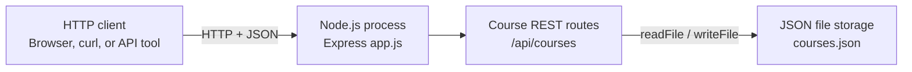
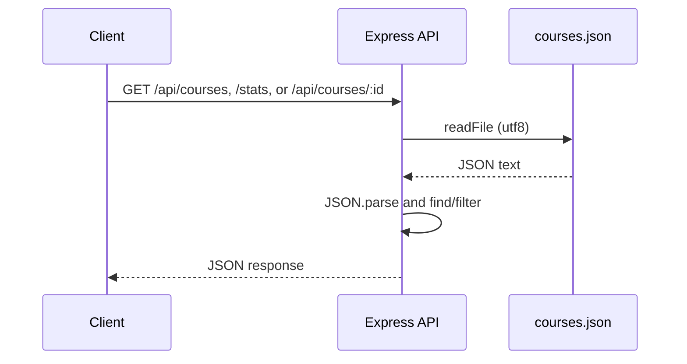

# CodeCraftHub Architecture

## Architectural Summary

CodeCraftHub is a single-process Node.js application using Express. It has no database, authentication service, user management, frontend, or external API.

## Components

### HTTP API

- **Runtime:** Node.js 20 or newer.
- **Framework:** Express.
- **Entry point:** `app.js`.
- **Middleware:** `express.json()` parses request bodies.
- **Resource:** `/api/courses`.
- **Statistics endpoint:** `GET /api/courses/stats`.
- **Port:** `5000`.
- **Responsibilities:** routing, validation, HTTP status codes, and JSON responses.

### Course Logic

Course logic remains in `app.js` to keep the beginner project easy to follow. It generates numeric IDs beginning at 1, creates ISO timestamps, validates required fields and dates, validates allowed statuses, performs CRUD operations, and calculates total and per-status statistics. Updates preserve the existing `id` and `created_at` values.

### JSON File Store

- **File:** `courses.json` in the project root.
- **Format:** a JSON array of course objects.
- **Read:** `fs/promises.readFile()` with UTF-8 encoding followed by `JSON.parse()`.
- **Write:** `fs/promises.writeFile()` with formatted `JSON.stringify()` output.
- **Initialization:** the file is created with `[]` if it does not exist.

## Data Flows

For `POST`, `PUT`, and `DELETE`, the API validates the request, reads the current array, modifies it in memory, writes the complete formatted array, and returns the result. Every mutation rewrites the complete file.

## Error Handling

- Validation errors return `400` with an error and details.
- Missing course IDs return `404`.
- Malformed JSON request bodies return `400`.
- File access failures, invalid stored JSON, non-array stored data, and unexpected errors return `500` without a false success response.

## Boundaries and Limitations

The application depends on the local filesystem and Node.js runtime. It is designed for one process and one local data file. Concurrent writes, multiple application instances, horizontal scaling, authentication, authorization, and external integrations are unsupported. Deploy only in a trusted environment and provide persistent writable storage for `courses.json`.